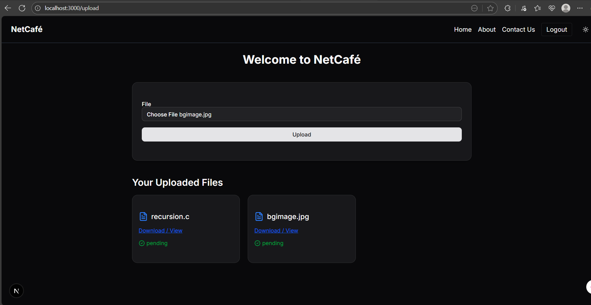
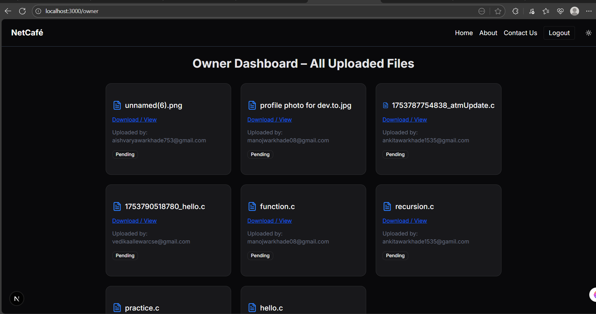

# 🖥️ Net Café File Upload System

A modern web application for a Net Café that allows users to upload files for printing, while the owner can manage and track all uploaded files.  
Built with **Next.js (App Router)**, **Firebase**, and **shadcn/ui**.

---

## 🚀 Features

### ✅ User Features
- Upload **PDFs & images** for printing.
- View **previously uploaded files** after login.
- Light/Dark mode toggle.
- Mobile-friendly responsive design.

### 🛠️ Owner Features
- View **all uploaded files** from all users.
- Mark files as **Printed**.
- Manage file status in real time.

---

## 📸 Screenshots

### User Dashboard


### Owner Dashboard


---
## 📞 Contact Us

If users need assistance, they can contact us directly through:

- **Phone**: +91 XXXXX XXXXX  
- **Email**: netcafe.support@email.com  
- **Address**: Net Café, Dhamangao Road, Near Gcoey ,Yavatmal ,  Maharashtra 

A contact form is also available on the website, allowing users to send direct messages which are stored in Firebase Firestore.

isit the [contact  page](https://net-cafe-website.vercel.app/contact-us) for more info.

---

## 📚 About This Website

This project is built for a local Net Café to simplify how customers submit documents for printing and other services.

Users can:
- Upload PDF/image files directly through the website.
- View their previously uploaded files if logged in.
- Café Owner can access a separate dashboard to manage print requests.

### 🖨️ Services Offered at the Net Café:
- **Photo printing**
- **Online form filling** (Exam forms, Government certificates, etc.)
- **Document scanning**
- **Color and B/W Xerox**
- **Resume and biodata printing**
- **Income certificate & caste certificate applications**
- **Aadhar-related services**
- **Discounts on bulk printing (live offers available on the site)**

Visit the [About page](https://net-cafe-website.vercel.app/about) for more info.

---

## 📂 Tech Stack
- **Frontend:** Next.js 14 (App Router) + Tailwind CSS
- **UI Components:** shadcn/ui
- **Backend:** Next.js API Routes
- **Database & Storage:** Firebase Firestore & Firebase Storage
- **Authentication:** Firebase Auth (Email/Password)

---

## ⚙️ Installation

```bash
# Clone the repository
git clone https://github.com/YOUR_USERNAME/net-cafe-website.git

# Go to project folder
cd net-cafe-website

# Install dependencies
npm install

# Run the development server
npm run dev


---

## 🌍 Live Demo

Check out the live version of the website:  
👉 [https://net-cafe-website.vercel.app](https://net-cafe-website.vercel.app/)
